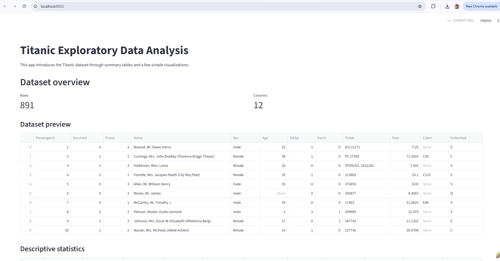
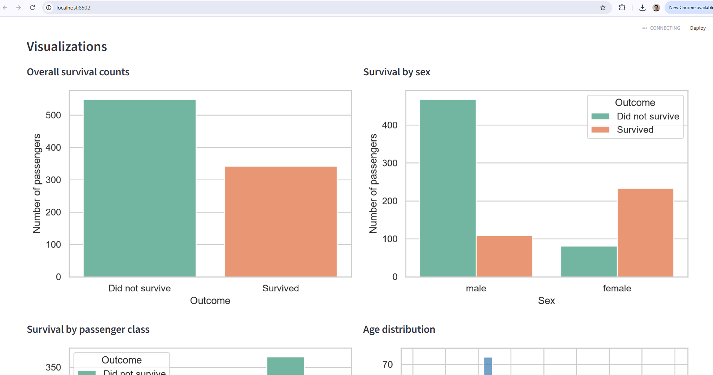

# Titanic Streamlit Exploratory Data Analysis

An interactive Streamlit application for exploring passenger data from the Titanic. The project provides an approachable introduction to exploratory data analysis (EDA), combining dataset inspection, summary statistics, and visual analysis of survival patterns and passenger characteristics.

## Dataset

The dataset is located at `data/titanic.csv` and contains passenger-level information, including:

- Survival status
- Passenger class
- Sex and age
- Family relationships
- Fare and cabin details
- Embarkation port

## Exploratory Data Analysis

The app supports the following EDA activities:

- Previewing the dataset and calculating descriptive statistics
- Checking the dataset's row and column counts
- Identifying missing values, particularly in `Age` and `Cabin`
- Exploring the relationship between survival, sex, and passenger class
- Examining the distributions of passenger age and fare

## Visualizations

The app includes:

- Overall survival count chart
- Survival-by-sex count chart
- Survival-by-passenger-class count chart
- Age histogram
- Fare histogram

## Main Findings

- More passengers did not survive than survived.
- Survival differed substantially by sex and passenger class.
- `Age` and `Cabin` contain missing values that should be considered in further analysis.
- Most fares are relatively low, with a small number of high-fare passengers.

## Screenshots

### Overview



### Visualizations



## Run Locally

This project uses [uv](https://docs.astral.sh/uv/) for dependency management.

```powershell
uv sync
uv run streamlit run app.py
```

Open the local URL displayed in the terminal, typically `http://localhost:8501`.
